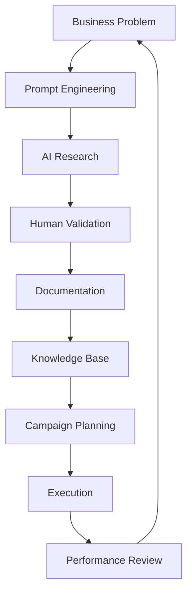

<div align="center">

# 🚀 GrowthPilot Marketing OS

### AI-Powered Marketing Operations System for Modern Startups

Build faster. Execute smarter. Scale consistently.

---


</div>

---

# Executive Summary

GrowthPilot Marketing OS is a comprehensive marketing operations system designed for early-stage and growth-stage SaaS startups.

Instead of managing campaigns across disconnected spreadsheets, documents, dashboards and communication channels, GrowthPilot centralizes every marketing workflow into a structured operating system.

The project demonstrates how AI-powered workflows, CRM systems, campaign planning, analytics dashboards, documentation and automation can work together to improve execution speed, campaign visibility and cross-functional collaboration.

This repository has been created as a complete marketing operating system showcasing modern Marketing Operations, Growth Marketing and Revenue Operations practices.

---

# Business Context

Modern startups face several operational challenges as they begin to scale.

Marketing teams often struggle with:

- scattered campaign documentation
- inconsistent execution
- lack of visibility
- poor knowledge management
- disconnected reporting
- manual campaign tracking
- duplicated work
- inefficient stakeholder communication
- delayed approvals
- inconsistent performance reviews

As teams grow from five people to fifty, these problems compound rapidly.

GrowthPilot Marketing OS demonstrates one possible solution by creating a centralized operating system where documentation, campaign execution, reporting, AI research and marketing knowledge coexist in one structured workspace.

---

# Problem Statement

Most startup marketing teams operate using multiple disconnected tools.

Typical workflow:

Google Docs

↓

Excel Sheets

↓

Slack

↓

Emails

↓

Notion

↓

CRM

↓

Analytics

↓

Presentations

↓

Weekly Reports

↓

Leadership Reviews

The result is:

- duplicated work
- inconsistent documentation
- missing campaign information
- delayed approvals
- poor knowledge sharing
- fragmented reporting
- manual reporting effort
- limited process visibility

Marketing teams spend significant time searching for information instead of executing campaigns.

---

# Solution Overview

GrowthPilot Marketing OS introduces a centralized Marketing Operations framework that combines documentation, planning, execution, analytics and AI-assisted workflows.

Core principles include:

- Single source of truth
- Documentation-first culture
- Standardized campaign execution
- AI-assisted research
- Automated reporting
- Data-driven decision making
- Reusable templates
- Cross-functional collaboration
- Continuous process improvement

The objective is to reduce operational friction while improving execution quality across every marketing initiative.

---

# Repository Objectives

This repository demonstrates how to build an integrated marketing operating system that can be adapted for SaaS companies, D2C brands, marketplaces or B2B platforms.

Primary objectives include:

- Standardize campaign planning
- Improve documentation quality
- Centralize marketing assets
- Organize customer research
- Maintain competitive intelligence
- Improve reporting consistency
- Build repeatable workflows
- Support marketing experimentation
- Enable AI-assisted decision making
- Increase operational efficiency

---

# Key Features

## 📋 Marketing Workspace

A centralized Notion workspace containing:

- Marketing Dashboard
- Campaign Calendar
- Weekly Planner
- Quarterly Roadmap
- Team Wiki
- Meeting Notes
- Brand Assets
- KPI Dashboard
- Campaign Tracker
- Experiment Log

---

## 🤖 AI Research Hub

Integrated AI workflows supporting:

- competitor research
- market research
- customer research
- campaign ideation
- positioning analysis
- messaging refinement
- content generation
- meeting summaries

Supported AI tools:

- ChatGPT
- Claude
- Gemini
- Perplexity
- NotebookLM

---

## 📈 Campaign Management

Campaign planning framework covering:

- objectives
- audience
- messaging
- creatives
- channels
- budgets
- timelines
- KPIs
- launch checklist
- post-campaign review

---

## 📊 Analytics Framework

Performance measurement includes:

- website traffic
- campaign reach
- engagement
- conversion rate
- CAC
- CPL
- SQL generation
- ROI
- retention
- attribution

Dashboards are designed using:

- GA4
- Looker Studio
- Google Sheets

---

## 🗂 Knowledge Base

Central documentation repository including:

- SOPs
- Templates
- Brand Guidelines
- Campaign Checklists
- AI Prompt Library
- Meeting Notes
- Research Documents
- Decision Logs
- Learning Repository

---

## ⚙ Automation Ready

Marketing workflows designed for automation using:

- Zapier
- Make
- HubSpot
- Airtable
- Gmail
- Slack
- Google Workspace

Automation opportunities include:

- lead assignment
- campaign notifications
- reporting
- meeting summaries
- CRM updates
- content approvals
- task creation

---

# Intended Audience

This repository is useful for:

- Marketing Managers
- Growth Managers
- Product Marketing Managers
- Marketing Operations Specialists
- Revenue Operations Teams
- Startup Founders
- Product Managers
- Business Operations Teams
- MBA Students
- Marketing Consultants

---

# Business Benefits

Implementing a structured Marketing Operating System can help organizations:

✔ Standardize marketing execution

✔ Improve campaign visibility

✔ Reduce manual reporting

✔ Improve collaboration

✔ Accelerate onboarding

✔ Improve documentation quality

✔ Support data-driven decisions

✔ Reduce duplicated work

✔ Create reusable marketing assets

✔ Scale marketing operations more efficiently

---

> **Note**
>
> GrowthPilot Marketing OS is a portfolio project created to demonstrate modern Marketing Operations, AI-assisted workflows, campaign management and business documentation practices. The workflows, dashboards and assets are intended for educational and portfolio purposes while following realistic startup operating principles.

---

# 🏗 System Architecture

GrowthPilot Marketing OS is designed as a modular Marketing Operations framework where every business function is documented, measurable, and scalable.

The architecture separates business documentation, campaign execution, CRM, analytics, automation, and AI-assisted research into reusable modules.

```text
                    GrowthPilot Marketing OS

                           Users

      ┌──────────────┬──────────────┬──────────────┐
      │              │              │              │
Marketing Team   Sales Team    Leadership    Operations
      │              │              │              │
      └──────────────┴──────────────┴──────────────┘
                           │
                           ▼
                 Marketing Operations Hub
                           │
 ┌──────────┬────────────┬────────────┬────────────┐
 │          │            │            │            │
Notion   Airtable    HubSpot      GA4      Looker Studio
 │          │            │            │            │
 └──────────┴────────────┴────────────┴────────────┘
                           │
                           ▼
                  Zapier / Make Automation
                           │
                           ▼
                     AI Assistants
       ChatGPT • Claude • Gemini • NotebookLM
```

---

# 📂 Repository Structure

```text
growthpilot-marketing-os/

│

├── README.md

├── LICENSE

├── CHANGELOG.md

├── ROADMAP.md

├── docs/

├── architecture/

├── campaigns/

├── dashboards/

├── notion/

├── ai/

├── research/

├── sop/

├── templates/

├── demo/

└── assets/
```

Every directory represents one functional area of a modern Marketing Operations team.

---

# 🛠 Technology Stack

| Category | Platform | Purpose |
|----------|----------|---------|
| Documentation | Notion | Knowledge base, campaign planning, SOPs |
| CRM | HubSpot | Contact management and sales pipeline (reference design) |
| Database | Airtable | Marketing database and structured records |
| Automation | Zapier | Workflow automation (planned implementation) |
| Automation | Make | Multi-step workflow orchestration (planned implementation) |
| Analytics | GA4 | Website and campaign analytics |
| Dashboard | Looker Studio | Executive reporting |
| AI | ChatGPT | Research, documentation, ideation |
| AI | Claude | Long-form writing and analysis |
| AI | Gemini | Workspace productivity |
| AI | NotebookLM | Knowledge synthesis |
| Data | Google Sheets | Working datasets and reporting |
| Version Control | Git & GitHub | Documentation and portfolio management |

---

# 🎯 Why This Stack?

The tools selected represent commonly used platforms in modern SaaS startups.

Together they support:

- campaign planning
- documentation
- CRM
- reporting
- stakeholder management
- automation
- AI-assisted research
- executive dashboards

The objective is to reduce manual work while improving visibility across marketing operations.

---

# 🔄 Marketing Operations Workflow

```text
Business Goal

↓

Market Research

↓

Customer Research

↓

Competitor Analysis

↓

Campaign Planning

↓

Content Creation

↓

Campaign Launch

↓

Performance Tracking

↓

Reporting

↓

Optimization

↓

Knowledge Repository

↓

Future Campaign Planning
```

Every completed campaign contributes new insights back into the documentation library, enabling continuous improvement.

---

# 📊 Information Flow

```text
Research

↓

Marketing Strategy

↓

Campaign Planning

↓

Execution

↓

Analytics

↓

Reporting

↓

Decision Making

↓

Documentation

↓

Future Planning
```

This approach ensures decisions are informed by both historical performance and current campaign data.

---

# 🤖 AI Workflow Reference

AI tools support—not replace—the marketing workflow.

Example activities include:

- generating campaign ideas
- drafting marketing copy
- summarizing research
- organizing meeting notes
- identifying competitor trends
- creating customer personas
- refining messaging
- documenting SOPs

Human review remains essential before publication or implementation.

---

# 🔗 Planned Tool Integration

The following diagram represents the intended interaction between systems as the portfolio evolves.

```text
Notion
│
├── Campaign Planning
├── Knowledge Base
├── SOP Library
└── Meeting Notes
        │
        ▼
Airtable
│
├── Marketing Database
├── Campaign Tracker
└── Content Calendar
        │
        ▼
HubSpot
│
├── Contacts
├── Companies
├── Deals
└── Lifecycle Stages
        │
        ▼
Zapier / Make
│
├── Notifications
├── Task Creation
├── Data Sync
└── Workflow Automation
        │
        ▼
GA4
│
├── Website Traffic
├── Campaign Performance
└── User Behaviour
        │
        ▼
Looker Studio
│
├── Executive Dashboard
├── Weekly Reports
└── Marketing KPIs
```

---

# 📈 Marketing Lifecycle


---

# 🤖 AI Research Lifecycle



---

# 📌 Design Principles

GrowthPilot Marketing OS follows several core principles:

- Documentation before execution
- Standardized workflows
- Reusable templates
- AI-assisted research
- Data-informed decisions
- Continuous improvement
- Cross-functional collaboration
- Knowledge sharing
- Transparent reporting
- Scalable processes

These principles guide every document, template, SOP, and workflow contained within this repository.
